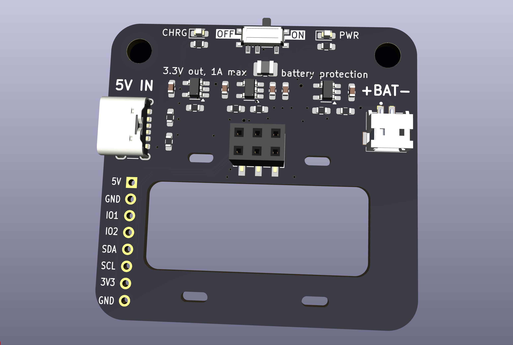
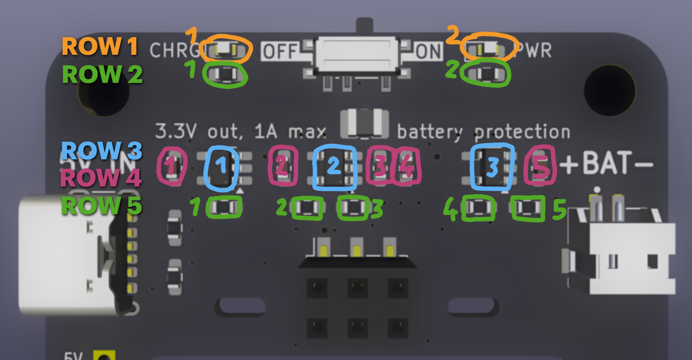

# VAPEorWEAR
Wearable SAO power pack

Designed around a battery, that is upcycled from a single use vape, that a friend of mine found (in worryingly large quantities) in the recycling room of his house. It features a proper battery charger and protection IC, so that the poor, abused lithium cell can now live a comfortable afterlife powering your shitty add ons!

# Features
* 400mAh upcycled battery that might smell like fruity vape juice
* Regulated 3.3V output, 1A max, with short circuit protection
* 2x M4 holes that should fit lanyard clips
* Rounded edges and no poking-out THT pins on the backside, to not ruin your nice t-shirt
* Battery protection and charging from USB
* On-Off switch (with a <3µA shutdown current)

# Kit content
If you received a kit, it should contain:
* 1x PCB
* 1x Up-cycled battery. It may smell fruity and be a bit sticky. I attempted to wash it.
* 3x Different ICs in SOT-23. Don't confuse which one is which!
* 1x USB connector
* 1x sliding switch
* 1x battery connector
* 1x SAO connector
* 1x 4.7uH inductor in 1008 package
* 1x 21k resistor
* 2x 1uF capacitor
* 3x 10uF capacitor
* 4x 560ohm resistor
* 5x 4.7k resistor

# Assembly instruction
For your convenience, most components are arranged in simple rows. The recommended order of soldering is row by row, and each row is listed **from left to right**

## ROW 1: LEDS
Negative (stripe) always faces left
1. White LED (charging indicator)
2. White LED (power indicator)

## ROW 2: LED resistors
1. 560R (sets brightness of charging LED)
2. 560R (sets brightness of power LED)
You can swap them for 4.7k ones if you want the LEDs dimmer

## ROW 3: ICs
Pin 1 (dot) is always bottom right
1. BRCL4054CME (battery charger). Package marking: "4054C"
2. MT3406 (buck converter). Package marking: "A1xx" (example: A15a)
3. RY2201 (battery protection). Package marking: "MKxxx" (example: MKJ3L)

## ROW 4: Capacitors
1. 1uF (bypass for charger)
2. 10uF (bypass for buck)
3. 10uF (output for buck)
4. 10uF (more output for buck, optional)
5. 1uF (bypass for protection IC)

## ROW 5: Resistors
1. 4.7k (charge current set resistor. 4.7k->212mA, 2k->500mA, 10k->100mA)
2. 4.7k (VOUT set resistor LOW)
3. 21k	(VOUT set resistor HIGH. Included combination results in 3.24V out)
4. 21k	(Buck converter ENABLE pull-up)
5. 560R	(Battery protection power filter)

## Remaining components:
Their position and orientation has been left as an exercise to the assembler
1. 4.7uH inductor for the buck converter
2. On-off switch
3. Battery connector
4. USB-C port
5. 2x 4.7k resistors near the USB-C port (yeah I know these are supposed to be 5.1k but I din't have those on a spool so this is what you get in the kit. Since it's a 1% one, It's stil in the 10% tollerance allowed for the 5.1k by the USB spec so as blasmphemous as this is, it should work)
6. SAO connector. Unkeyed, sorry!

# Post assembly test
1. Do not plug in battery yet!
2. Plug in USB power source and test if VBAT reads approx. 4.2V
	* The charge LED is allowed to blink erratically
3. Turn the switch ON and check if 3.3V out reads approx 3.3V 
4. Check polarity of battery cable. Compare it with the print on the silkscreen
5. If so, you can unplug the usb, plug in the battery and enjoy your VAPEorWEAR

# Design details
## [RY2201](https://www.lcsc.com/datasheet/C370889.pdf) battery protection IC
* Overcharge protection at 4.3V
* Overdischarge protection at 2.4V
* Overcurrent protection at 3.0A

## [BRCL4054CME](https://www.lcsc.com/datasheet/C305436.pdf) battery charger IC
* CCCV charging to 4.2V
* R11 sets charging current. Recommended 4.99k gives 200mA (2.5h charge time)
* For fastest allowed charging (500mA) use 2k resistor instead. 
* CHRG led will shine during charging, and gently glow when done

## [MT3406](https://www.lcsc.com/datasheet/C22462728.pdf) buck converter
* Efficiently produces 3.3V from VBAT
* 1A output continuous, 2A self-protected limit
* Paired with [INPAQ WIP252012P-4R7ML](https://www.lcsc.com/datasheet/C964123.pdf) inductor (4.7µH, 1.9A ISat, 196mΩ)
* Not a boost-buck, so output voltage will start dropping as VBAT drops below 3.4V

## [ON/OFF switch](https://www.lcsc.com/datasheet/C22435662.pdf) and PWR LED
* Switch controls the ENABLE pin of the buck converter
* LED is connected to the output 3.3V rail
* Quiescent current when OFF < 3µA
* Quiescent current when ON approx. 1.2mA

## [USB-C port](https://www.lcsc.com/datasheet/C42400650.pdf) for 5V input

## 31 x 13mm battery cavity
* With 4x 3x1.5mm zip-tie or tape slots for mounting
* Prominently shows the battery, no mechanical cell protection offered
* JST-ZH (1.5mm) 2-pin connector

## 2.54mm pin row for connecting to the SAO
* breaks out all SAO pins, and 5V and extra GND
* VCC, GND and I2C pins are arranged so that an I2C OLED (example SSD1306) can be connected directly, should the SAO feature a micro and wish to display something.

# Other notes
The component values are a bit funky, since they are heavily consolidated. If you are assembling this with access to a full selection of passives, pick better values.